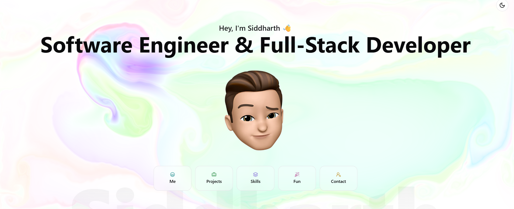

**Static portfolios are dead.**  
So I built a dynamic portfolio with color flows.
You can experience it live! [Portfolio](https://sidse.netlify.app/)

## 🚀 How to run

Want to run this project locally? Here's what you need:

### Prerequisites
- **Node.js** (v18 or higher)
- **pnpm** package manager

### Setup
1. **Clone the repository**
   ```bash
   git clone <your-repo-url>
   cd portfolio
   ```
   
2. **Install dependencies** (It will take some time so be patient)
   ```bash
   pnpm install
   ```
   
3. **Run the development server**
   ```bash
   pnpm dev
   ```

4. **Open your browser**
   Navigate to `http://localhost:3000`


### **Built by developer, for developers!**
